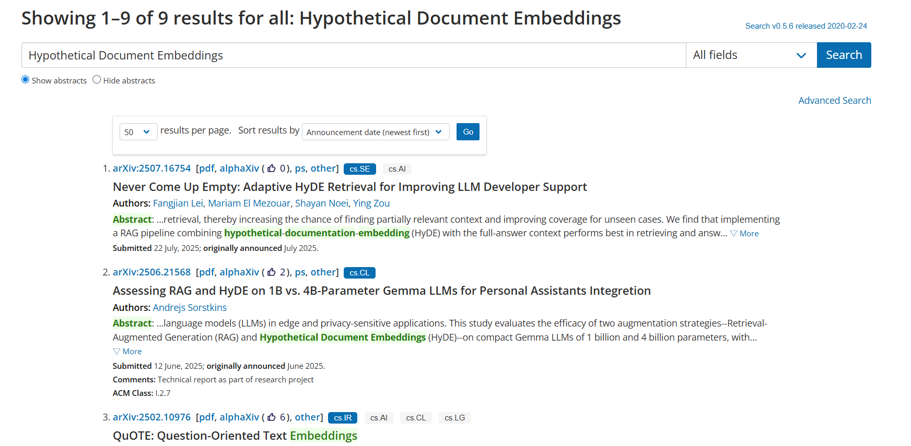
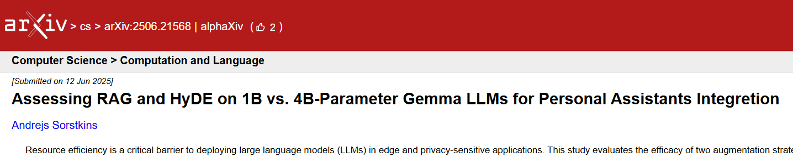

# fastfood

这里放一些咱写的自用脚本或者页面 🍕

## 0. 本仓库的脚本可能会出现以下情况

* 随心所欲的写，越浪越开心 ︿(￣︶￣)︿ ~~（能用就行，不过现在是越写越用心了）~~  
* 维护断断续续，如学校教务相关的脚本咱毕业后就没法维护了  

## 1. 目录

### 1.0. 脚本目录

* （非油猴脚本）[生成文章页面的简单目录](./scripts/catalogue.js)   

* （油猴脚本）[重新用 `$$` 和 `$` 包裹数学公式](./scripts/formulaRewrapper.js)   
  * 主要用于大模型生成的带公式文本。  

* （油猴脚本）[整活型GPA计算工具 (适用于 WHPU 正方教务系统)](#20-整活型gpa计算工具)  
  * 因为咱已经毕业，所以这个脚本就不维护了。

* （油猴脚本）[AutoDL JupyterLab URL 复制按钮](#21-autodl-jupyterlab-url-复制按钮)  

* （油猴脚本）[arXiv 页面展示 alphaXiv 链接和点赞数](./scripts/kaomoji.js)   

### 1.1. 页面目录

* [逃跑的颜文字](./pages/kaomoji.html) - 有个域名但是不知道页面放什么时就用这个吧。  

## 2. 脚本说明

### 2.0. 整活型GPA计算工具

让查绩点变得更喜庆点吧！  

> [!WARNING]
> 已经本科毕业，此脚本停止维护。  

   
↑ 点击图片查看演示视频  

* 具体见GreasyForks上的页面： [点我前往](https://greasyfork.org/zh-CN/scripts/440188-%E6%95%B4%E6%B4%BB%E5%9E%8Bgpa%E8%AE%A1%E7%AE%97%E5%B7%A5%E5%85%B7-%E9%80%82%E7%94%A8%E4%BA%8Ewhpu%E6%AD%A3%E6%96%B9%E6%95%99%E5%8A%A1%E7%B3%BB%E7%BB%9F)  

### 2.1. AutoDL JupyterLab URL 复制按钮

  

主要用于在 AutoDL 控制台快速复制 JupyterLab 的 URL (带 token)，以便在 VSCode 中进行连接（苦逼做实验中 ... T_T）  

> 通过拦截页面中 `XMLHttpRequest` 的响应来实现，因为 AutoDL 会轮询一个 `/api/v1/instance` 接口来更新列表信息。如果没有按钮可以尝试刷新一下实例列表。  

* [autodl-jupyterlab-url-copier.js](./scripts/autodl-jupyterlab-url-copier.js)
* [GreasyFork 页面](https://greasyfork.org/zh-CN/scripts/545633-autodl-jupyterlab-url-copier)  

### 2.2. alphaXiv 链接和点赞数展示脚本  

简单的小脚本，在 arXiv **搜索列表**和**摘要页面**展示对应的 alphaXiv 链接和点赞数，论文受欢迎程度一目了然。  

> 鉴于没有观察到有获取点赞数的接口 (alphaXiv 采用了服务端渲染)，目前通过匹配和提取 alphaXiv 页面中的 `upvotes_count` 字段来实现点赞数的获取。   

