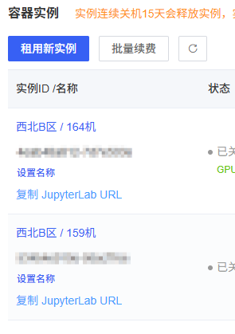

# fastfood
这里放一些咱写的自用脚本或者页面 🍕

## 本仓库的脚本可能会出现以下情况

* 随心所欲的写，越浪越开心<del>（能用就行）</del>
* 可维护性低
* 待更新

## 脚本目录

* [生成文章页面的简单目录（非油猴脚本）](catalogue.js)

* [重新用 `$$` 和 `$` 包裹数学公式（油猴脚本）](https://github.com/SomeBottle/fastfood/blob/main/formulaRewrapper.js)
  * 主要用于大模型生成的带公式文本。  

* [整活型GPA计算工具(适用于WHPU正方教务系统)](#整活型gpa计算工具)

* [AutoDL JupyterLab URL 复制按钮（油猴脚本）](#autodl-jupyterlab-url-复制按钮)  

## 页面目录

* [逃跑的颜文字](kaomoji.html) - 有个域名但是不知道页面放什么时就用这个吧。  

## 脚本说明

### 整活型GPA计算工具

具体见GreasyForks上的页面： [点我前往](https://greasyfork.org/zh-CN/scripts/440188-%E6%95%B4%E6%B4%BB%E5%9E%8Bgpa%E8%AE%A1%E7%AE%97%E5%B7%A5%E5%85%B7-%E9%80%82%E7%94%A8%E4%BA%8Ewhpu%E6%AD%A3%E6%96%B9%E6%95%99%E5%8A%A1%E7%B3%BB%E7%BB%9F)  

### AutoDL JupyterLab URL 复制按钮

  

主要用于在 AutoDL 控制台快速复制 JupyterLab 的 URL (带 token)，以便在 VSCode 中进行连接（苦逼做实验中 ... T_T）  

> 通过拦截页面中 `XMLHttpRequest` 的响应来实现，因为 AutoDL 会轮询一个 `/api/v1/instance` 接口来更新列表信息。如果没有按钮可以尝试刷新一下实例列表。  

* [autodl-jupyterlab-url-copier.js](./autodl-jupyterlab-url-copier.js)  

